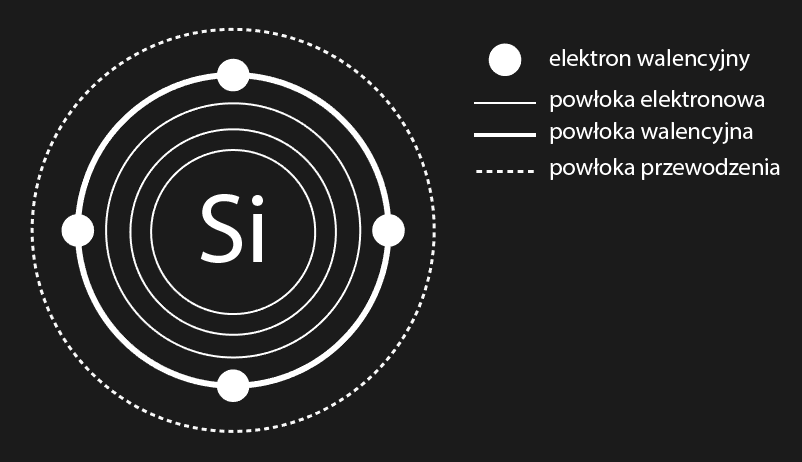

### A Diode and a Transistor
4 XII 2022
Fundamentals of the basic semiconductor nonlinear compoments. Physical model of conductors, insulators, and semiconductors. Single-diode rectifier, Full bridge rectifer, NPN bipolar junction transistor. 

- A diode is an electronic component that has two terminals: 
    $(+)$ Anode --> Cathode $(-)$
- The basic model of a diode is an ideal rectifier diode: 
    - Current can flow through an ideal diode in only one direction.
    - The diode is therefore used to set the direction of current flow.
    - An ideal diode connected in forward bias is an ideal conductor. In practice, as a result of inter-particle interactions in the PN barrier layer, there is a voltage drop $V_D$. For silicon $V_{Silicon}=0.7V$
- Other types of LEDs include:
    - LED - Light Emitting diode - Light source
    - Zener diode - Voltage stabilization
    - Schottky diode - Operating at high frequencies

An electric current is a stream of charged particles.

An ability to conduct comes from aligning the conduction band in the atom:
- In conductors, like **copper**, the conduction band practically overlaps the valence band, so that the electrons are free to detach and conduct.
- In insulators, like **styrofoam**, the conduction band is too far away and the electrons on the valence band are too numerous for the atom to take any more. The atom is therefore unable to give or take any electrons.
- A semiconductor, like **silicon**, acts as an insulator. The conduction band is close enough that with the relatively small energy we are able to move some electrons above the valence band and conduct.

Semiconductor layer formation (Doping):

**N-TYPE LAYER** Pure silicon does not have many free electrons, so in the process of creating a semiconductor, a small amount of material with many free electrons is added to form an enriched layer. E.g. by adding phosphorus (which has 5 instead of 4 valence electrons)

**P-TYPE LAYER** By adding another material that has very few free electrons, a so-called depleted layer is formed. For example, by adding aluminum (which has only 3 valence electrons)

We combine **P-type** and **N-type**. As a result, due to the diffusive flow of electrons, a PN layer is formed, which is called a depletion region.

Electrons are said to have a negative charge, and a lack of electrons (holes) are said to have a positive charge. As a result of diffusion, an electric field is created, which does not allow the remaining electrons to move in the same direction. In silicon, the potential difference between these regions is about $U_{Silicon}=0.7V$.

A **voltage** applied in the **forward bias** above the voltage drop across the diode will cause **current** to flow.

$U>U_{Diode}\implies$ Conduction. 

A **voltage** applied in the **reverse bias** will cause the barrier layer to enlarge, and current **will not flow**.
If the reverse bias voltage is exceeded, the diode will be destroyed.

$U>U_{Reverse}\implies$ Damage to the diode. 

Diode parameters:
- Maximum reverse bias voltage
- Forward bias voltage
- Maximum current flowing through the diode

Diode Applications:
- The diode is capable of rectifying voltage. Turn AC current into DC:
    - Single Bridge - 1 diode - Half period rectification 
    $U(t) = U_0 sin(\omega t)\implies$
    $
    \begin{cases}
    U = 0\text{, jeśli}\space sin(\omega t)<0 \implies \frac{2\pi n + \pi}{\omega} < t < \frac{2\pi n}{\omega}\\
    U = U_0 sin(\omega t)\text{, jeśli}\space sin(\omega t)\geq 0 \implies \frac{2\pi n}{\omega} \leq t \leq \frac{2\pi n + \pi}{\omega}
    \end{cases}
    $
    - Graetz bridge (in the diagram) - 4 diodes - Full bridge rectifier 
    $U(t) = U_0 sin(\omega t)\implies$
    $
    U = | U_0 sin(\omega t) |
    $
- The diode protects the circuit from mistakenly reversing the terminals

Multimeter:
- The diode test allows you to test a diode in the forward bias and in the reverse bias.

### Transistor

The transistor mainly serves as:
- Switch
- Signal amplifier

A Bipolar Junction Transistor (BJT) is an electronic component with three leads:
- (B) Base
- (C) Collector
- (E) Emitter

The arrow on the symbol indicates conventional current flow.

**Transistor current gain**
$\beta=\frac{I_c}{I_b}$

NPN bipolar junction transistor symbol:

By applying sufficient voltage between the base and emitter, conduction of current from the base to the emitter will occur, as in a normal diode. 

When $V_{Base}>U_{BE}$ then $I_{BE}>0$. 

Little current flows through the base because the base is enriched much less than the emitter and collector in the enrichment process, so that few electrons are able to move from the emitter to the base.

By applying sufficient voltage between the base and emitter and applying voltage between the base and collector, conduction occurs between the collector and emitter. A small number of electrons then go from the emitter to the base, and a great number of electrons go from the emitter to the collector.

When $V_{Collector}>V_{Emitter}$ and $I_{BE}>0$ then $I_{CE}>0$

In the state of overfitting $I_B>0$ 
From the principle of conservaftion of charge 
$I_E = \frac{q}{t}$ and $q_E=q_B+q_C\implies$
$I_E = I_C + I_B \implies I_E>I_C$

### Basic circuits on the transistor

- Switch
- Logic gates (TTL system (Bipolar Junction Transistor), CMOS (Field Effect Transistor)).