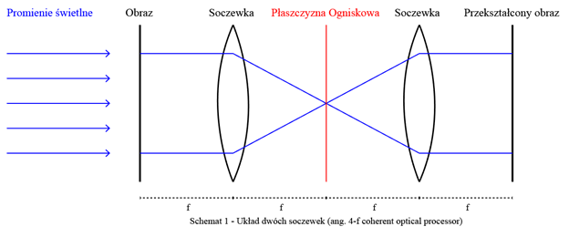
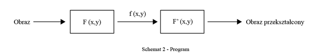
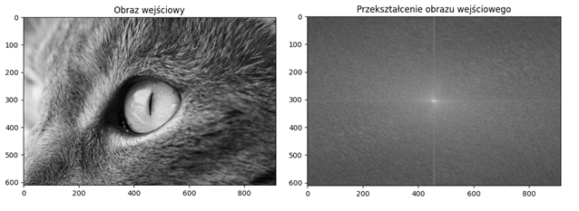
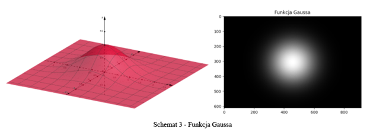
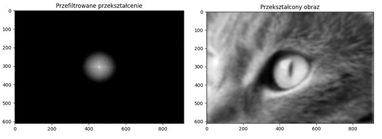
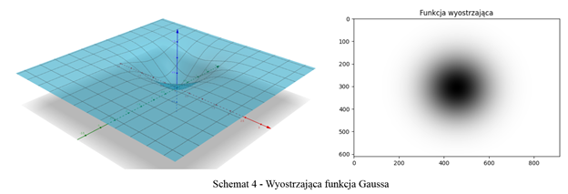
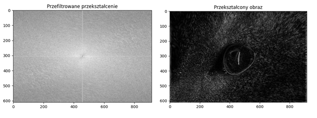

### Rozmycie i wyostrzenie funkcją otworową
15 I 2022 RW
Rozmycie oraz wyostrzenie obrazu przy użyciu przekształcenia Fouriera oraz funkcji otworowych.

**Wprowadzenie** 
Optyka Fourierowska to dziedzina zajmująca się przetwarzaniem sygnałów świetlnych 
w dziedzinie częstotliwości przestrzennych. Zachodzące zjawiska dyfrakcji oraz interferencji można wyjaśnić na gruncie optyki falowej. Dwuwymiarowe przekształcenie Fouriera dokonywane jest cho¬ciażby przez układ dwóch soczewek oraz padającej na nie fali świetlnej. W płaszczyźnie ogniskowej pierwszej  soczewki zachodzi wówczas rozkład sygnału na składowe fale płaskie, których zbiór tworzy widmo przestrzenne. Proces znajduje zastosowanie obliczeniowe, gdyż w odróżnieniu do tradycyjnych systemów logicznych soczewka wykonuje operacje z prędkością światła. 

**Obróbka obrazu** 
Przypuśćmy możliwość umieszczenia filtra w płaszczyźnie ogniska powyższego układu. 
Dla każdej fali świetlnej przechodzącej przez płaszczynę zachodzi wówczas modyfikacja widma częstości przestrzennych zgodnie z zadaną funkcją $f(x,y)$. Funkcja $f$ nazywana jest funkcją otworową. Okazuje się, 
że umieszczenie filtra w tym specyficznym miejscu pozwala na uzyskanie interesujących efektów. Proces można również za symulować wykonując poniższy program:

Zasada działania programu polega na przyjęciu obrazu w postaci dwuwymiarowej listy zawierającej natężenie światła w skali szarości, która następnie zostaje przekształcona w przestrzeń częstotliwościową. Odpowiada za to funkcja $F(x,y)$ z powyższego schematu. Cześć procesu oznaczona pierwszą strzałką jest widoczna na dwóch wykresach poniżej. Pierwszy z nich to obraz wejściowy, drugi jest jego przekształceniem Fouriera. Dwie charakterystyczne linie w płaszczyznach XY przecinające się na środku pod kątem prostym wskazują na prostokątny charakter poszczególnych części w płaszczyźnie obrazu. Wskazuje to na cyfrowy charakter obrazu wejściowego. Częstotliwość na wykresie przekształcenia rośnie wraz z oddalaniem się od środka wykresu.

**Symulacja rozmycia** 
Rozmycie obrazu można osiągnąć osłabiając wysokie częstotliwości w przekształceniu obrazu wejściowego. Wycinanie wysokich częstotliwości spowoduje znaczne zmniejszenie szczegółowości obrazu. Filtr w tym przypadku nazywany jest filtrem dolnoprzepustowym.
Zasadniczą częścią symulacji jest opracowanie funkcji otworowej, która będzie w sposób odpowiedni filtrować przekształcone widmo. Przykładem takiej funkcji jest funkcja Gaussa dla przestrzeni dwuwymiarowych. Dana jest wzorem:  
$f(x,y)=exp\bigg(- \frac{(x-x_0)^2}{(2\sigma_X^2} +\frac{(y-y_0)^2}{2\sigma_Y^2}\bigg)$

Dla obrazu o rodzielczości O\left(a,b\right)=O(914,610) przyjęte zostały następujące wartości: 
$x_0=\frac{a}{2},\ y_0=\frac{b}{2},\ \sigma_X=\frac{a}{b},\ \sigma_Y=20$

Zadana funkcja prezentuje następujące wyniki. Przekształcony obraz O jest utworzony według następującej funkcji. Dla każdego punktu obrazu zachodzi przekształcenie odwrotne $F\prime$ iloczynu przekształcenia $F$
z funkcją otworową f. 
$O=F^\prime (F\cdot f)$

**Symulacja wyostrzenia** 
Bezpośrednim przeciwieństwem rozmycia jest wyostrzenie. Wyostrzenie polega na wycięciu niskich częstotliwości z przekształcenia obrazu wejściowego. Funkcja otworowa g(x,y) filtra wyostrzającego będzie wyglądać następująco: 
$g\left(x,y\right)=1-exp\left(-\left(\frac{\left(x-x_0\right)^2}{2\sigma_X^2}+\frac{\left(y-y_0\right)^2}{2\sigma_Y^2}\right)\right)$

